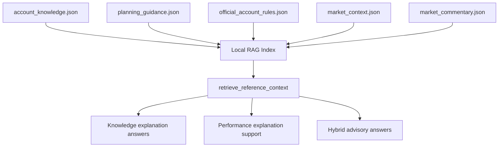

# Canada Reference Data

This folder contains the local reference knowledge [本地参考知识] used by the Canada wealth insights workspace.

These files are not client-case transaction data. They are explanation-focused knowledge sources that support `RAG`, safer answers, and market-context interpretation.

## What Is In This Folder

- `account_knowledge.json`: what common Canadian account types are for
- `planning_guidance.json`: planning priorities, budgeting guidance, and safety notes
- `official_account_rules.json`: official-rule style summaries used for grounded finance explanations
- `market_context.json`: watchlist configuration and market-layer setup
- `market_commentary.json`: current market narrative and month-level portfolio commentary
- `README.md`: this overview

## How The App Uses These Files

The current code uses this folder in three main ways:

1. `deterministic planning logic [确定性规划逻辑]`
   `planning_guidance.json` helps the recommendation engine decide product priority order.

2. `RAG retrieval [检索增强生成]`
   `rag_pipeline.py` chunks these reference files into a local JSON index.

3. `market explanation support [市场解释支持]`
   `market_context.json` and `market_commentary.json` help explain why a portfolio moved, not just what products exist.

## Current RAG Coverage

The local RAG index now includes chunks from:

- account knowledge
- planning rules
- budgeting guidelines
- advisor safety notes
- official account rules
- market context overview
- market watchlist descriptions
- current market story
- market themes
- month-level market explanations

## Reference-Layer Diagram

## Why This Separation Matters

Keeping these files separate from `artifacts_canada/` makes the system easier to explain:

- `artifacts_canada/` = client-case facts [客户事实]
- `reference_canada/` = reusable knowledge [可复用知识]

That separation is helpful for:

- clearer architecture diagrams
- easier testing
- safer grounding
- better interview explanation
