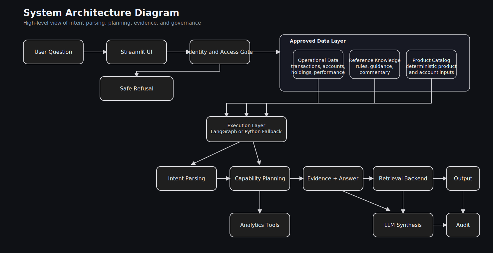
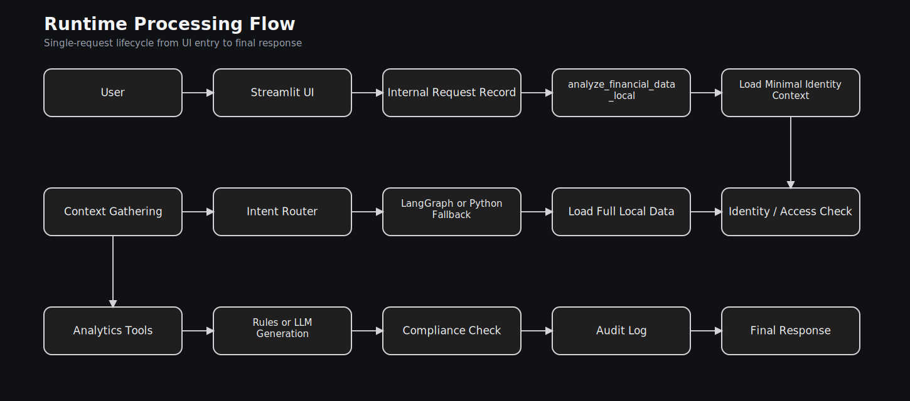
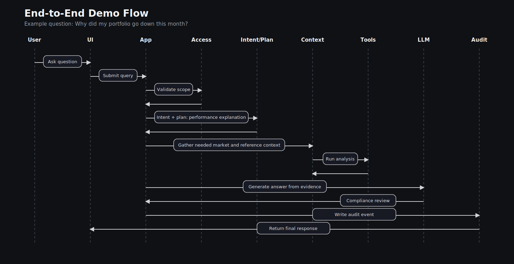
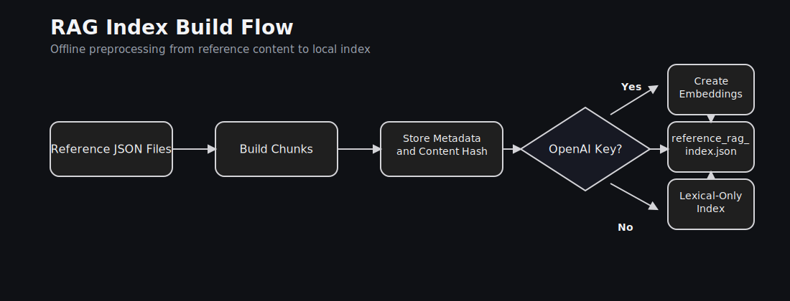
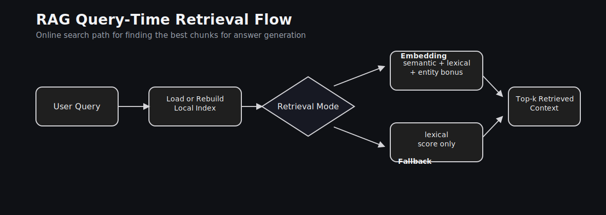
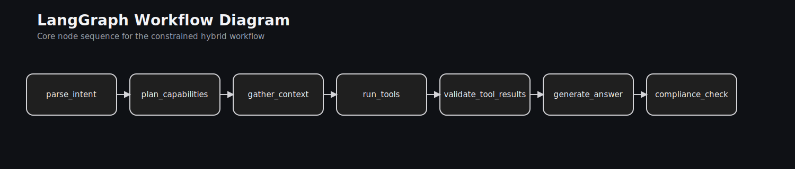
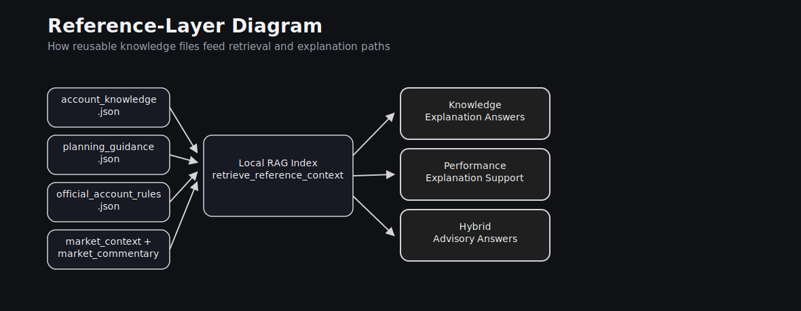

# Architecture Diagrams

Use this file as the single place for project diagrams when you explain the system to an interviewer.

Recommended speaking order:

1. `System Architecture Diagram`: the big picture
2. `Runtime Processing Flow`: what happens during one request
3. `End-to-End Demo Flow`: one realistic question journey
4. `RAG Index Build Flow`: how knowledge becomes searchable
5. `RAG Query-Time Retrieval Flow`: how the app finds relevant chunks
6. `LangGraph Workflow Diagram`: the orchestration path
7. `Reference-Layer Diagram`: how reference data supports answers

## 1. System Architecture Diagram

Use this when you want to explain the whole system at a high level.

Focus:

- major layers
- main data sources
- LLM-first intent/tool planner and capability planner
- orchestration path
- where LLM, RAG, tools, and compliance fit

## 2. Runtime Processing Flow

Use this when you want to explain what the app does during one live request.

Focus:

- request lifecycle
- validation order
- when data is loaded
- when conversation resolution, intent/tool planning, tools, evidence validation, generation, and audit happen

This diagram uses a fixed SVG layout so it stays readable in VS Code preview.

## 3. End-to-End Demo Flow

Use this when you want to walk an interviewer through one concrete scenario such as:

`Why did my portfolio go down this month?`

Focus:

- step-by-step request journey
- access control
- intent/tool planning and capability planning
- optional RAG and tool usage
- compliance and audit

## 4. RAG Index Build Flow

Use this to explain the offline preprocessing step.

Focus:

- reference files become chunks
- embeddings are optional
- output is a local index, not a vector database

## 5. RAG Query-Time Retrieval Flow

Use this to explain the online retrieval step.

Focus:

- index load
- retrieval backend choice
- ranking logic
- retrieved context for answer generation

## 6. LangGraph Workflow Diagram

Use this to explain only the orchestration graph.

Focus:

- node order
- clean workflow design
- separation between intent/tool planning, deterministic tools, evidence validation, generation, and compliance

## 7. Reference-Layer Diagram

Use this to explain where the knowledge files fit.

Focus:

- which reference files feed the RAG layer
- how that layer supports explanation and hybrid answers

