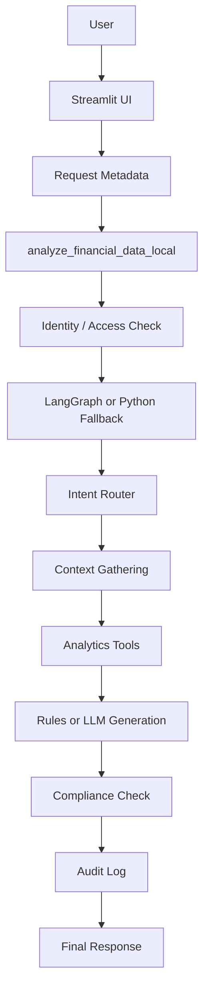

# Local Advisory Workspace Guide

This folder contains the Canada-focused advisory workspace [顾问工作区].

The current version is no longer just a simple finance chatbot. It now demonstrates a more complete advisory demo chain [完整演示链]:

- request metadata capture [请求元数据]
- identity and access control [身份与权限控制]
- intent routing [意图路由]
- structured data retrieval [结构化数据读取]
- RAG over local finance references [本地金融知识检索]
- analytics tool calling [分析工具调用]
- optional LLM generation [可选模型生成]
- compliance guardrails [合规护栏]
- audit logging [审计日志]

## What This Workspace Does

- Reads household transaction, account, holdings, and performance data from `data/artifacts_canada/`
- Reads Canadian planning rules, account knowledge, official rules, market context, and market commentary from `data/reference_canada/`
- Uses a deterministic recommendation engine for product-priority questions
- Uses `LangGraph` to orchestrate a multi-step workflow
- Uses local analytics tools for portfolio-performance explanation
- Optionally uses the OpenAI Responses API for richer grounded answers when `OPENAI_API_KEY` is set
- Writes request traces to `data/artifacts_canada/audit_logs/app_audit.jsonl`

## Main Files

- `app/app_local.py`: Streamlit UI, sample questions, developer mode, and request metadata controls
- `app/local_financial_qa.py`: main controller for summary building, routing, tool execution, generation, compliance, and audit logging
- `app/demo_governance.py`: demo identity/access checks, compliance guardrails, and audit log writing
- `app/analytics_tools.py`: portfolio performance attribution, exposure breakdown, and volatility analysis
- `app/data_sources.py`: data loading and live market snapshot integration
- `app/query_router.py`: route selection logic
- `app/response_orchestrator.py`: fetches RAG context and market data only when needed
- `app/rag_pipeline.py`: local chunking, embeddings, and retrieval
- `app/langgraph_flow.py`: multi-node LangGraph workflow
- `../requirements-local.txt`: runtime dependencies

## Quick Runtime Diagram

## Setup

1. Create a virtual environment:

   `python -m venv .venv`

2. Activate it in PowerShell:

   `.\.venv\Scripts\Activate.ps1`

3. Install dependencies from the project root:

   `pip install -r 01_your_canada_version/requirements-local.txt`

4. Create a `.env` file from `.env.example`

   Leave `OPENAI_API_KEY` empty for rules-based mode, or set it to enable LLM-assisted answers.

5. Run the app:

   `streamlit run 01_your_canada_version/app/app_local.py`

## Suggested Demo Questions

- `Show my household account summary.`
- `Explain my current portfolio allocation.`
- `Why did my portfolio go down this month?`
- `Why did my returns change this month?`
- `Explain market changes and what they mean for this portfolio.`
- `Based on my profile, should I focus on FHSA, TFSA, or RRSP?`

## Best Interview Demo Story

If you want one clean interview story [面试叙事], use:

`Why did my portfolio go down this month?`

Why this is a strong example:

- it triggers `intent classification`
- it uses `structured portfolio data`
- it retrieves `market commentary` through RAG
- it runs `analytics tools`
- it can show `LLM grounding`
- it passes through `compliance`
- it leaves an `audit trail`

## Why This Structure Works Well

This workspace stays small enough to learn step by step, but it now shows a more realistic GenAI application shape:

- deterministic logic where facts must stay stable
- retrieval where documented knowledge is needed
- LLM generation only after the system has enough grounded context
- governance controls before and after generation
