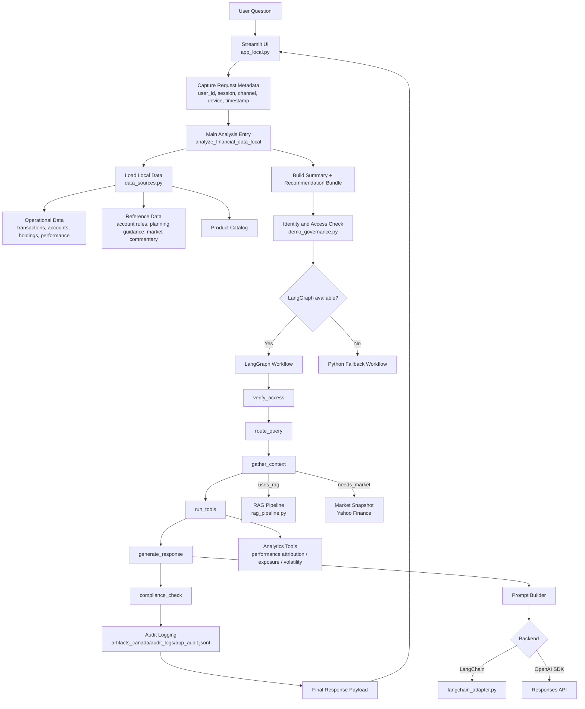
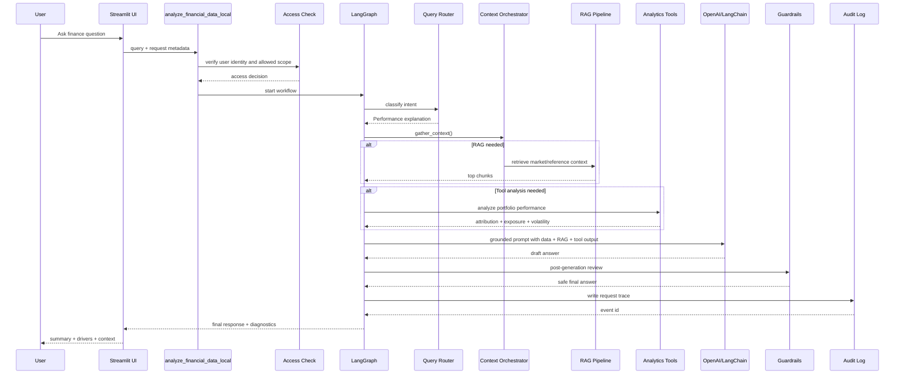
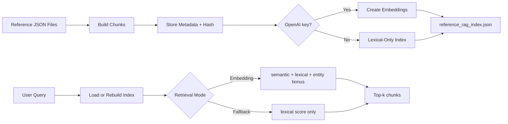
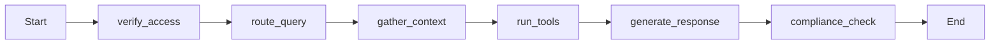

# Financial Advisory GenAI

This repository contains the current Canada-first financial advisory demo app [演示应用].

Main app path:

`01_your_canada_version/`

Detailed architecture document:

- [System Architecture Design](./01_your_canada_version/docs/SYSTEM_ARCHITECTURE.md)

## What This Demo Shows

This project now demonstrates a fuller end-to-end advisory workflow [端到端顾问流程], not only a simple chat app.

It includes:

- `multi-channel entry [多渠道入口]`: web, mobile-app, or advisor-platform style request metadata
- `identity and access control [身份与权限控制]`: access is checked before AI reasoning
- `intent routing [意图路由]`: rules-based query classification with LangGraph orchestration
- `structured data retrieval [结构化数据读取]`: holdings, performance, accounts, transactions
- `RAG [检索增强生成]`: retrieval over local Canada finance reference and market commentary files
- `analytics tools [分析工具]`: portfolio performance attribution, exposure breakdown, volatility summary
- `LLM generation [模型生成]`: optional OpenAI output grounded in local data
- `compliance guardrails [合规护栏]`: post-generation wording checks and basic PII redaction
- `audit logging [审计日志]`: each request writes a JSONL audit event

## Main App Folders

Important folders inside `01_your_canada_version/`:

- `app/`: Streamlit UI [界面], routing [路由], orchestration [编排], analytics tools, and LLM integration
- `data/artifacts_canada/`: synthetic client-case data [客户案例数据], product data, RAG index, and audit logs
- `data/reference_canada/`: local finance reference knowledge [参考知识], market context, and market commentary
- `docs/`: project documentation [项目文档]
- `requirements-local.txt`: local dependencies [依赖]

## Run The App

From the repo root:

```powershell
.\.venv\Scripts\python.exe -m streamlit run 01_your_canada_version\app\app_local.py --server.port 8506 --browser.gatherUsageStats false
```

## Architecture Summary

This app uses a hybrid architecture [混合架构]:

- `rules engine [规则引擎]`: deterministic recommendation scoring and finance summaries
- `RAG [检索增强生成]`: retrieval over local account, planning, official-rule, and market-commentary content
- `analytics tool layer [分析工具层]`: grounded portfolio analysis for performance-explanation questions
- `LangChain`: optional prompt pipeline [提示词流水线]
- `LangGraph`: workflow orchestration [工作流编排]
- `OpenAI Responses API`: optional final language generation
- `Yahoo Finance via yfinance`: optional live ETF snapshot

## System Architecture Diagram



## End-to-End Demo Flow

This is the current real logic chain [真实逻辑链] for a question like:

`Why did my portfolio go down this month?`



## RAG Logic

The RAG layer [检索层] is local and lightweight [轻量].

It uses:

- `account_knowledge.json`
- `planning_guidance.json`
- `official_account_rules.json`
- `market_context.json`
- `market_commentary.json`

Generated local index:

`01_your_canada_version/data/artifacts_canada/reference_rag_index.json`

### Retrieval Flow



## LangGraph Workflow

Current workflow in `langgraph_flow.py`:



### Node Meaning

- `verify_access`: enforce identity and data scope before AI reasoning
- `route_query`: classify the user question
- `gather_context`: fetch RAG context and/or live market snapshot only when needed
- `run_tools`: run deterministic analytics for routes like portfolio performance explanation
- `generate_response`: use rules or LLM generation
- `compliance_check`: soften unsafe wording and attach compliance metadata

## Best Demo Scenario

If you want one interview-friendly scenario [面试友好场景], use this:

- User asks: `Why did my portfolio go down this month?`
- System checks identity
- System classifies the query as `Performance explanation`
- System reads portfolio performance and holdings
- System retrieves market commentary through RAG
- System runs analytics tools
- System generates a grounded explanation
- System runs compliance review
- System logs the request for audit

This is stronger than a simple chat demo because it shows `workflow`, `control`, `grounding`, and `governance`.

## Key Files To Learn First

Read in this order:

1. `01_your_canada_version/app/app_local.py`
2. `01_your_canada_version/app/local_financial_qa.py`
3. `01_your_canada_version/app/demo_governance.py`
4. `01_your_canada_version/app/query_router.py`
5. `01_your_canada_version/app/response_orchestrator.py`
6. `01_your_canada_version/app/analytics_tools.py`
7. `01_your_canada_version/app/rag_pipeline.py`
8. `01_your_canada_version/app/langgraph_flow.py`
9. `01_your_canada_version/app/prompt_builder.py`

## Repo Root

Top-level files and folders kept on purpose:

- `.github/`: GitHub workflow configuration
- `.venv/`: local virtual environment
- `.env.example`: example environment variables
- `README.md`: root guide
- `01_your_canada_version/`: active app
